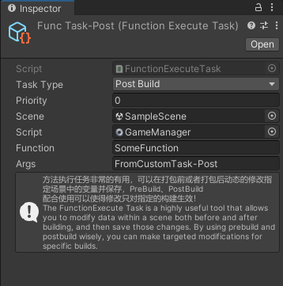
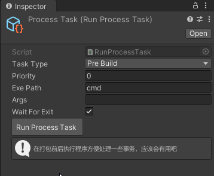
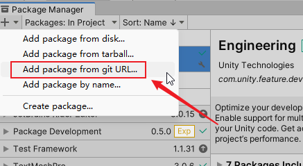

# Application Auto Builder

# 作用 (Features)：

1. 一次配置，一键打包，输出多个应用：
   
    one config, one click, output multiple applications, see the picture below:

2. 支持在打包前后通过 Task 参与到打包流程中，支持场景内数据修改，支持执行应用程序，支持文件操作（计划中）
   
    Support participating in the packaging process through Task before and after packaging, support scene data modification, support application execution, support file operation (in plan)

3. 支持 .exe 和 .apk 的打包，其他文件类型拿到源码自己加
   
    Support .exe and .apk packaging, other file types get the source code and add them by yourself
   
   ```csharp
   var dir = $"{config.appLocationPath}/{profile.productName}";
   {
    var ext = config.targetPlatform switch
    BuildTarget.StandaloneWindows => ".exe",
    BuildTarget.StandaloneWindows64 => ".exe",
    BuildTarget.Android => ".apk",
    _ => throw new Exception("不支持的打包平台！") // TODO: 其他平台的后缀请各领域专家补充，欢迎提 PR
   };
   var file = $"{dir}/{profile.productName}{ext}";
   ```
   
   文件在这里(Files are here)：[AutoBuilder.cs](Packages/App Auto Builder/Editor/AutoBuilder.cs)

# 界面（Interface）：


| Function Execute Task                                                                      | Run Process Task                                                                                                                                                       |
| ------------------------------------------------------------------------------------------ | ---------------------------------------------------------------------------------------------------------------------------------------------------------------------- |
|                                                                |                                                                                                                                             |
| 通过这个 task ，你可以写逻辑在打包前后对 scene 内的任意数据进行修改                                                   | 通过这个 Task，你可以在构建前、后运行一个应用程序，可以设置是否卡主线程，方便控制打包流程                                                                                                                        |
| With this task, you can write logic to modify any data in the scene before and after build | With this Task, you can run an application before and after the build, and you can set whether to block the main thread to facilitate the control of the build process |

# 使用（Usage）：

1. Clone 本仓库或者使用 UPM 安装（Install with UPM）
   
    Clone this repository or install with UPM



```
https://github.com/Bian-Sh/Unity-Application-Auto-Builder.git/?path=Packages/App%20Auto%20Builder/
```

2. 通过菜单 Tools -> App Auto Builder 打开界面
   
    Open the interface through the menu Tools -> App Auto Builder

3. 在弹出的面板中依次配置好打包平台、打包路径、应用名称、版本信息、包含的场景以及打包前后需要处理的自定义任务
   
    Configure the packaging platform, packaging path, application name, version information, included scenes and custom tasks to be processed before and after packaging in the pop-up panel in turn

4. 完成上述配置，点击 Build 按钮即可开始打包，看到控制台输出 `打包成功` 字样即表示打包完成
   
    After completing the above configuration, click the Build button to start packaging. When you see the console output "Build successfully", it means that the packaging is completed

# 演示 (Animation)：


# 计划 （Todo）

1. FunctionExecuteTask 支持当用户指定场景后自动获取该场景使用的所有 Type 供用户选择                
   
    FunctionExecuteTask support automatic acquisition of Type after specifying the scene for users to choose

2. FunctionExecuteTask 支持当用户选定 Type 后自动获取 参数为 string 或者 prefab（计划支持 string 和 prefab）的函数供用户选择
   
    FunctionExecuteTask supports automatic acquisition of functions with parameters as string or prefab (plan to support string and prefab) for users to choose after the user selects Type

3. FunctionExecuteTask 新增一个变体，支持对 prefab 做打包前、后的修改（目前支持的是对 Scene 文件修改）
   
    FunctionExecuteTask adds a variant that supports modification of prefab before and after packaging (currently supports modification of Scene file)

4. 得益于 EditorSettings 的 Preset 功能，我想如果能够支持用户在打包前、后恢复不同的 Preset 数据会不会很有帮助。
   
    Thanks to the Preset function of EditorSettings, I think it would be helpful if users could restore different Preset data before and after build application.

5. 我希望自定义 Task 可以通过 ReorderableList 右下角 + 添加，可以选择 Task类型，自动构建实例并赋值，同时将其存为主配置文件的 subassets 
   
    I hope that custom Task can be added by ReorderableList in the lower right corner +, Task type can be selected, instance can be automatically built and assigned, and saved as a subassets of the main configuration file .

6. 我希望自定义 Task 全部绘制在 EditorWindow 上，不需要用户额外选中他们才能修改配置
   
    I hope that all custom Task can be drawn on EditorWindow, and users do not need to select them separately to modify the configuration

7. FileOperationTask 感觉不是很紧急，如果需要用户可以自己继承 BaskTask 随便写写就行
   
    FileOperationTask doesn't feel very urgent. If you need it, you can inherit BaskTask and write it casually

**最后，如果有什么好的建议，欢迎提 issue 或者 pr**

**Finally, if you have any good suggestions, please feel free to issue or pr**

# 扩展阅读 （Reference）：

[[Unity 3D] 多场景任意组合的一键出多包的打包工具](https://www.jianshu.com/p/4ad5be33b60b?v=1667139567703) 
